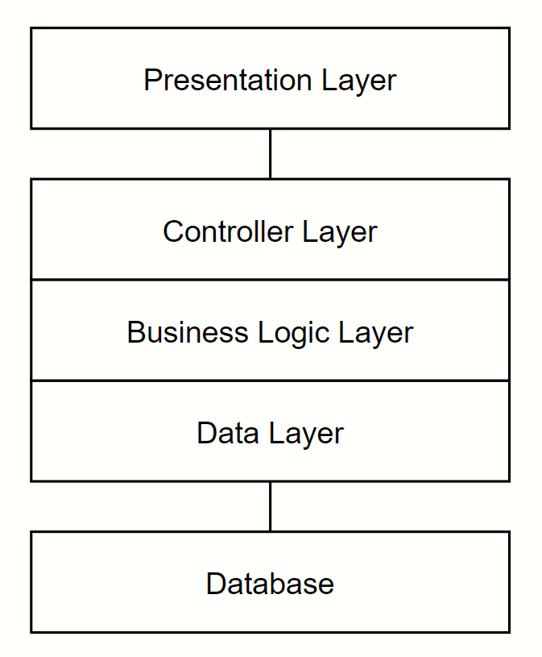
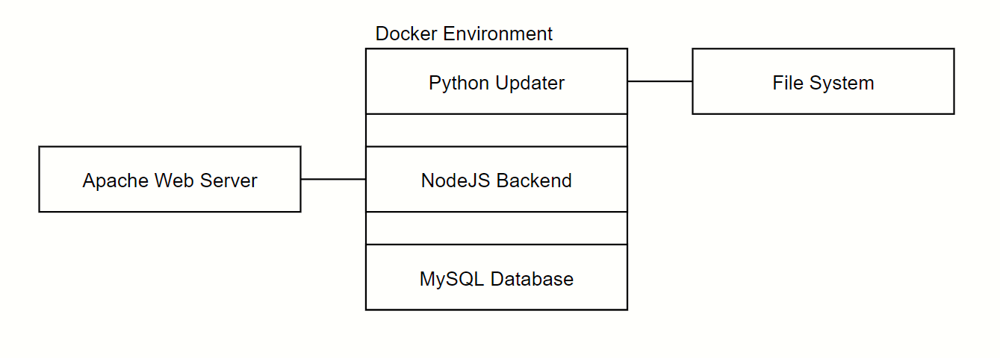

# Architecture and Design Document

**Document owner:** Samuele Pozzani is responsible for developing and maintaining this document.  
**Date:** April 26, 2020  
**Version:** 1.0

## Table of Contents

- [Architecture and Design Document](#architecture-and-design-document)
  - [Table of Contents](#table-of-contents)
  - [Revision History](#revision-history)
- [1 Introduction](#1-introduction)
- [2 Design Goals](#2-design-goals)
- [3 System Behaviour](#3-system-behaviour)
- [4 Logical View](#4-logical-view)
  - [4.1 High Level Hierarchy](#41-high-level-hierarchy)
  - [4.2 Mid Level Design](#42-mid-level-design)
  - [4.3 Low Level Design](#43-low-level-design)

## Revision History

| Version | Date     | Name            | Description      |
|---------|----------|-----------------|------------------|
| 1.0     | 04/26/20 | Samuele Pozzani | Initial document |

# 1 Introduction

This document describes the architecture and design for the MarconiTT application being developed for ITI G. Marconi.

The purpose of this document is to describe the architecture and design of the MarconiTT application in a way that addresses the interests and concerns of all major stakeholders. For this application the major stakeholders are:

- Users and the customer – they want assurances that the architecture will provide for system functionality and exhibit desirable non-functional quality requirements such as usability and reliability.
- Developers – they want an architecture that will minimize complexity and development effort.
- Project Manager – the project manager is responsible for assigning tasks and coordinating development work. He or she wants an architecture that divides the system into components of roughly equal size and complexity that can be developed simultaneously with minimal dependencies. For this to happen, the modules need well-defined interfaces. Also, because most individuals specialize in a particular skill or technology, modules should be designed around specific expertise. For example, all UI logic might be encapsulated in one module. Another might have all business logic.
- Maintenance Programmers – they want assurance that the system will be easy to evolve and maintain on into the future.

The architecture and design for a software system is complex and individual stakeholders often have specialized interests. There is no one diagram or model that can easily express a system’s architecture and design. For this reason, software architecture and design is often presented in terms of multiple views or perspectives [IEEE Std. 1471]. Here the architecture of the MarconiTT application is described from 4 different perspectives [1995 Krutchen]:

1. Logical View – major components, their attributes and operations. This view also includes relationships between components and their interactions. When doing OO design, class diagrams and sequence diagrams are often used to express the logical view.
2. Process View – the threads of control and processes used to execute the operations identified in the logical view.
3. Development View – how system modules map to development organization. 
4. Use Case View – the use case view is used to both motivate and validate design activity. At the start of design the requirements define the functional objectives for the design. Use cases are also used to validate suggested designs. It should be possible to walk through a use case scenario and follow the interaction between high-level components. The components should have all the necessary behavior to conceptually execute a use case.

# 2 Design Goals

There is no absolute measure for distinguishing between good and bad design. The value of a design depends on stakeholder priorities. For example, depending on the circumstances, an efficient design might be better than a maintainable one, or vise versa. Therefore, before presenting a design it is good practice to state the design priorities. The design that is offered will be judged according to how well it satisfies the stated priorities.

The design priorities for the MarconiTT application are:
- Minimize complexity and development effort.
- Decrease the amount of time needed to update the application.
- Increase overall performance.

# 3 System Behaviour

The use case view is used to both drive the design phase and validate the output of the design phase. The architecture description presented here starts with a review of the expect system behavior in order to set the stage for the architecture description that follows. For a more detailed account of software requirements, see the requirements document.

# 4 Logical View

The logical view describes the main functional components of the system. This includes modules, the static relationships between modules, and their dynamic patterns of interaction.

In this section the modules of the system are first expressed in terms of high level components (architecture) and progressively refined into more detailed components and eventually classes with specific attributes and operations.

## 4.1 High Level Hierarchy

 

The architecture system for the MarconiTT application is an n-tier architecture. This architecture system is designed to allow for proper information hiding, modular components, and single system dependencies. The abstraction of the presentation layer, and consequently the User Interface (UI), allow for a flexible pipeline for the optimization of the UI to meet customer needs and expectations. There are multiple layers between the Presentation Layer and the lowest level, but they are all coded in one single monolitich file to simplify the structure. The Database layer is the lowest level in the hierarchy.

## 4.2 Mid Level Design

 

The docker envirnoment contains three containers:
1. Database (mysql 5.7)
2. Backend (NodeJS)
3. Timetable updater (alpine 3.7 - Python)

## 4.3 Low Level Design 

IMMAGINE DI RAUL :D