# User Guide

**Document owner:** Mateo Picari is responsible for developing and maintaining this document. 
**Date:** April 25, 2020  
**Version:** 1.0

## Revision History

| Version | Date       | Name         | Description      |
| ------- | ---------- | -----------  | ---------------- |
| 1.0     | 25/04/2020 | Mateo Picari | Initial document |

## Introduction

MarconiTT is a web application available to desktop and mobile users and accessible through a browser. It can be reached both from inside and outside the school network. The application allows for authorized teachers, students and staff members to book school classrooms and labs. This document will provide instructions on how to view if classrooms or labs are booked or not, how to book them and how to view or insert events.

## Main scenarios of use

### Visiting MarconiTT

Go to [apps.marconivr.it](), that is the home page of the webserver, and click on the "AuleTT" tile.

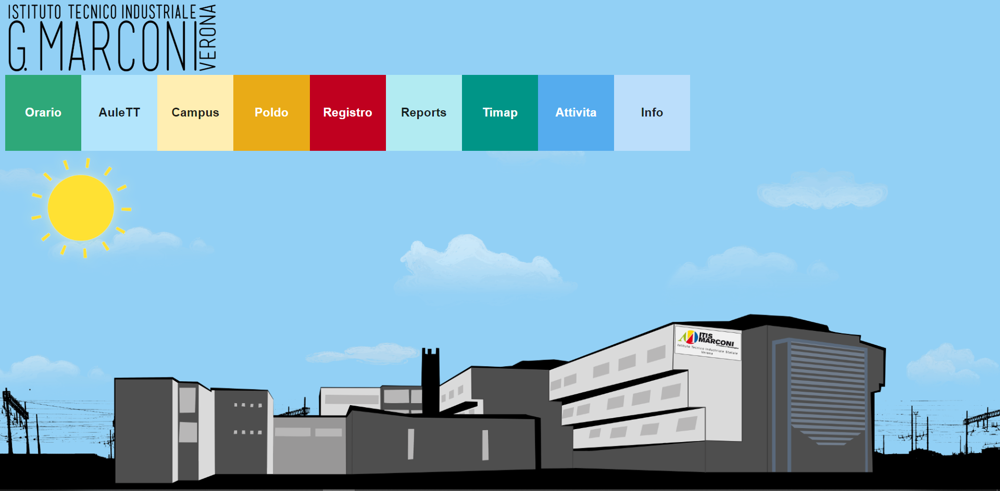

Now you'll be able to see the main page of MarconiTT. The left side shows a login form, which means that initially you're not logged in. You can log in only if you are an authorized teacher, student or staff member. Without logging in you'll be able only to view booked classrooms.

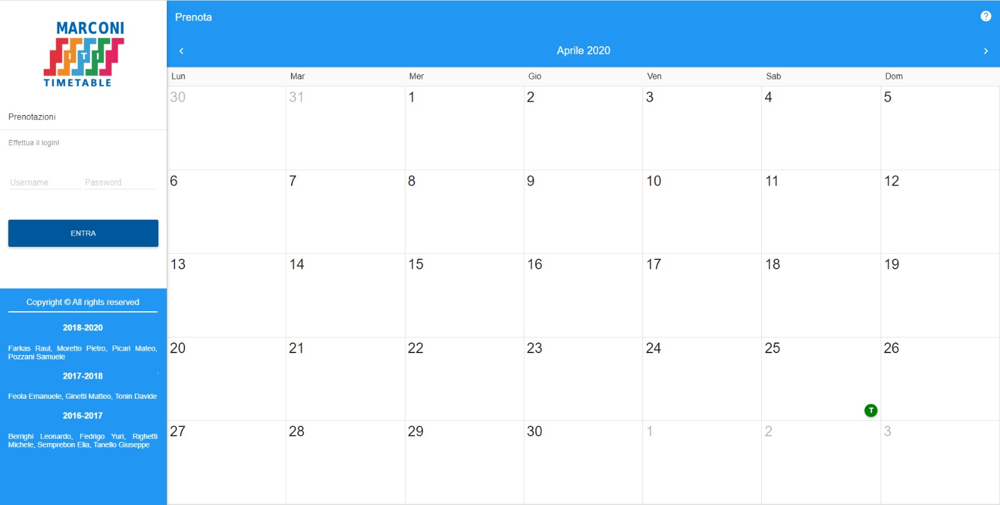

### Viewing bookings

To view the bookings, you need to click on a specific day that you want to explore. After doing that, you will be able to see for each classroom if it's been booked, if it's already occupied by another class because of the regular school hours or if it's available. There are also 3 filters that allow you to switch from classrooms to labs, to select a specific classroom or lab (you will view only one row) and to select only a period (the number of columns will change based on the number of selected hours, that can be more than one).

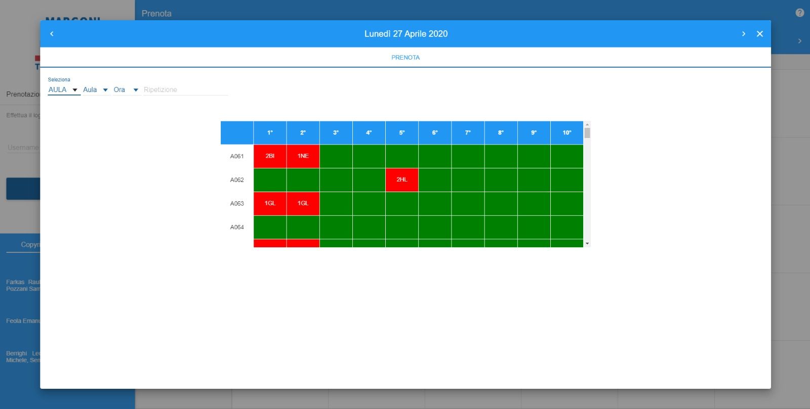

### Booking classrooms or labs

If you're allowed, you can login in order to book a classroom or insert an event. The following screen will show up. As you can see, now there are multiple options in the left side, and the default option "Prenotazioni" is the one that allows you to book classrooms.

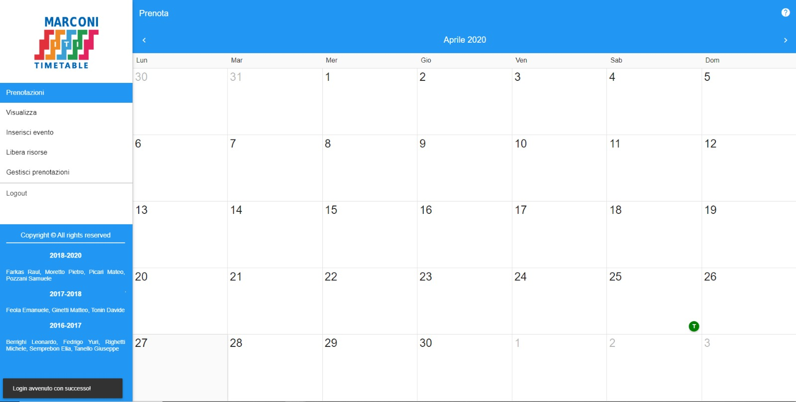

After clicking on a chosen day and a chosen classroom (in an hour when it must be available), you have to select from the drop down menu the reason why you are booking it. Then you also have to type in for how long you're booking the classroom for (be careful, if you don't pay attention you may overwrite another booking. If this happens, then a warning message will show up and you will have to confirm your booking).

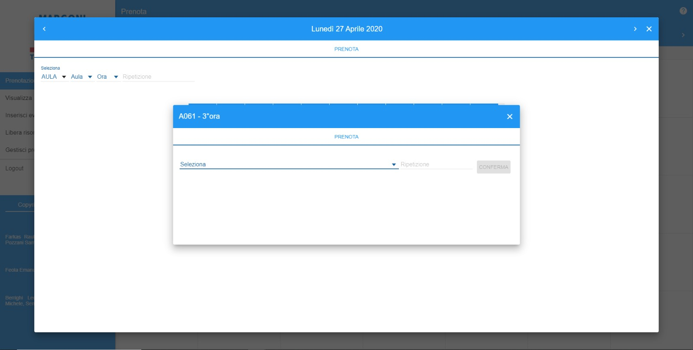

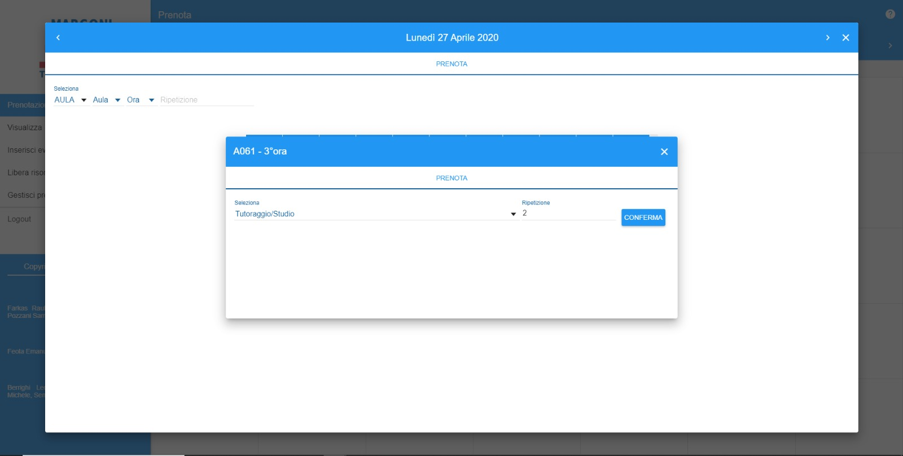

Now your booking has been successfully completed and everybody will be able to see it.

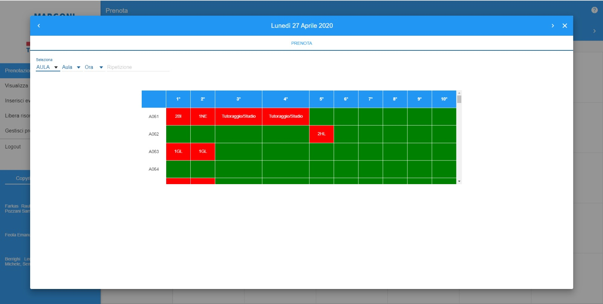

### Viewing bookings and events

When you are in the "Visualizza" section, after you clicked on a chosen day, you will be able to see the bookings of a specific class, teacher or classroom by setting the filters.

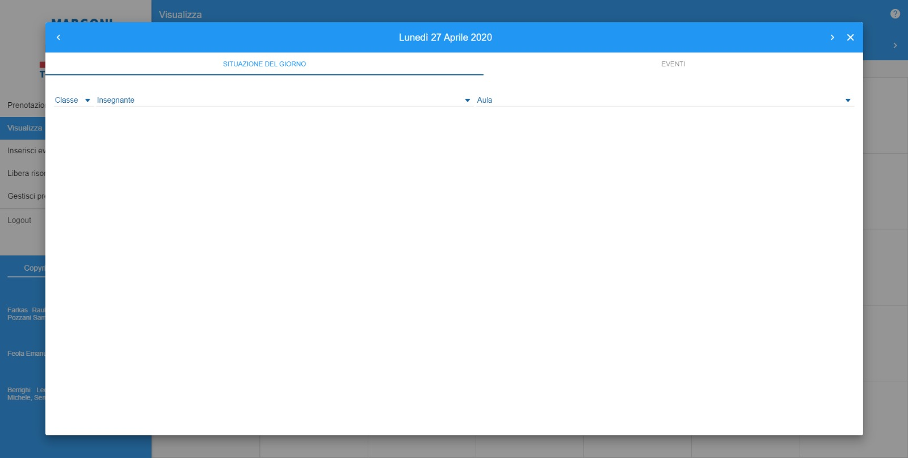

You can also see the events planned for that day.

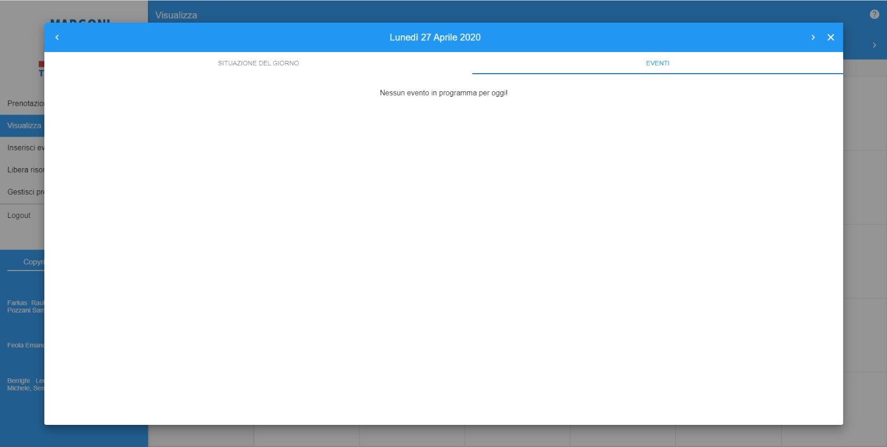

### Inserting events

Now let's see how to insert an event. In the "Inserisci evento" section, you have to describe the event you are going to insert, then you have to set the date, the start time, the end time, the classes that are going to attend that event and the classroom where the event will take place (This is usually used only by the school staff).

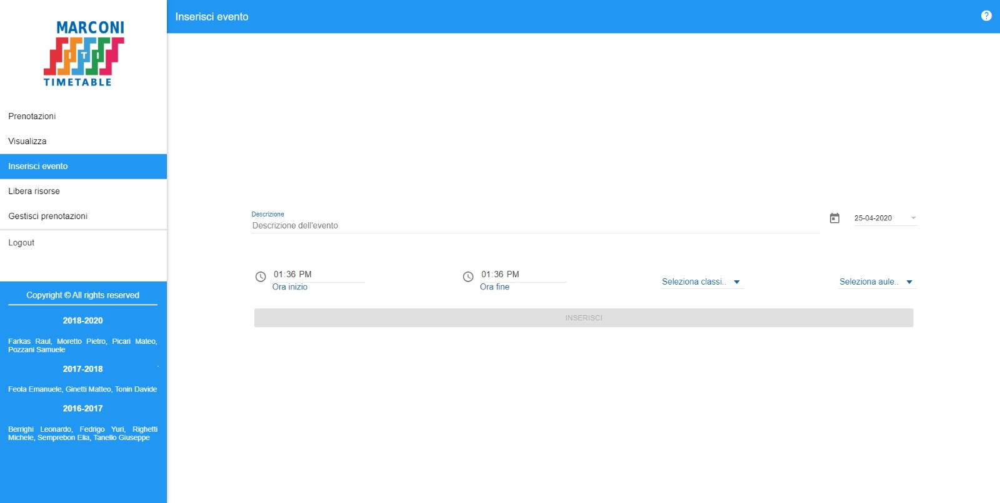

### Freeing up resources

The "libera risorse" section is used to free up classrooms or labs when classes go on school trips. The school staff has to insert the start date, the end date, the hours that are being set as available and the class that is going on a trip (This is usually used only by the school staff).

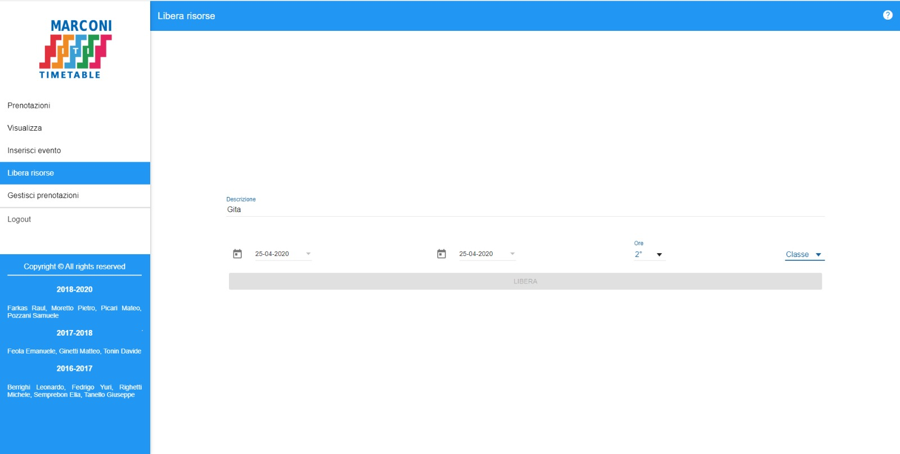

### Managing bookings and events

The "Gestisci prenotazioni" section shows a complete overview of classrooms and labs bookings. Here it's also possible to filter bookings by day, to see the old ones and to quickly delete bookings (This is usually used only by the school staff).

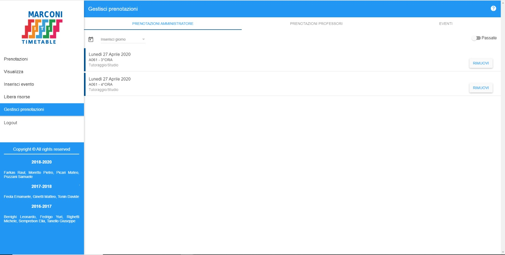

Once you're done, you can logout just by clicking on the "Logout" button.
